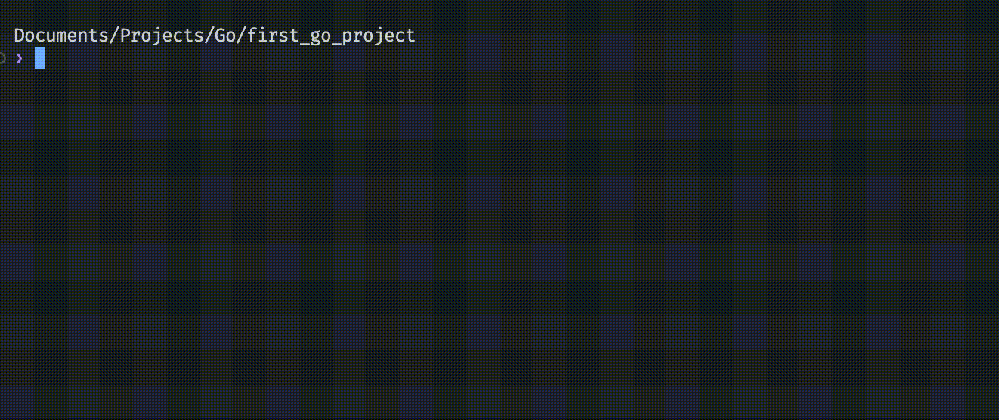

# CLI ToDo List

This is a simple project that allows users to insert tasks to a list. This is my first Go project to get a grip with some of the fundamentals.

## Learnings

|   |   |   |
|---|---|---|
| Variables | Structs  | Dates  |
| Loops  | Strings  | Splices  |
| Functions  | Pointers  | I/O  |

## Screenshots

